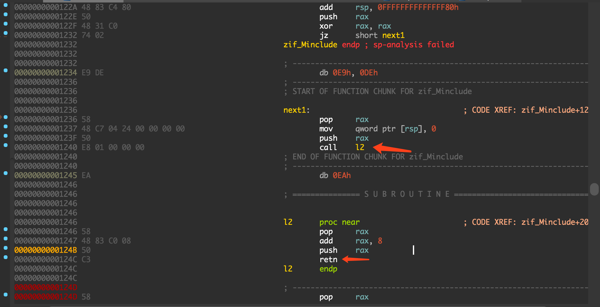
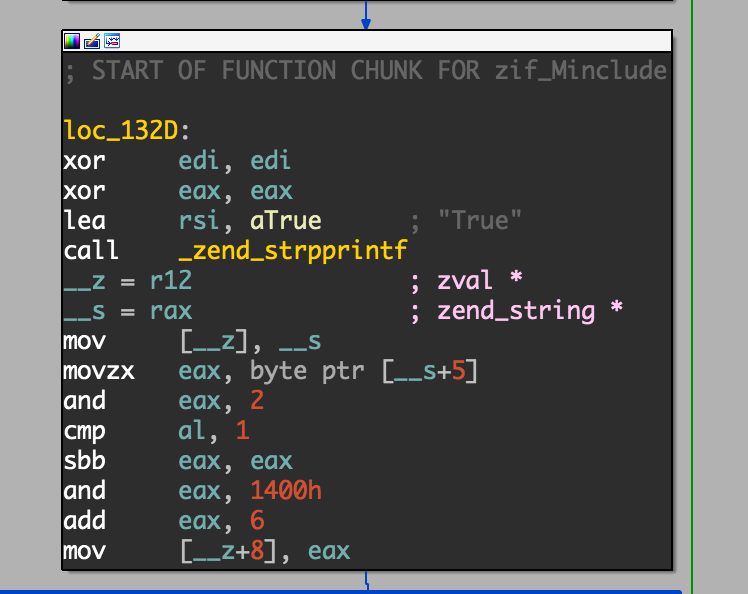

### 前言

此题目比较简单，作为我学习php pwn的第一课。

其实就是个简单的栈溢出，本身跟php没啥关系，唯一的贡献是我知道了怎么调试libphp。

### writeup 

Minclude 扩展的的函数 `zif_Minclude` 存在花指令，导致栈不平衡。

其实相当于一个 `jmp`，跳转到了 `rax + 8` 的位置，所以把这些指令都nop掉，直接跳转到 `0x124d`就好了。

接着就是 `000000000000129D call    _memcpy` 导致的一个栈溢出。就是个普通的栈溢出，找rop就可以解了。

但是php扩展中，下图中的代码会修改栈上的数据，影响最后进行rop，所以这里需要放一些无用的数据，防止破坏payload，在真实利用过程中此处使用4个pop操作进行绕过。

最后一个坑点问题，就是我用pwn师傅给的payload一直打不通，主要是因为调用 system 函数的时候指令 `movaps xmmword ptr [rsp+0x40], xmm0 `奔溃了。查了一些资料才知道 [http://blog.binpang.me/2019/07/12/stack-alignment/](http://blog.binpang.me/2019/07/12/stack-alignment/)，[http://homura.cc/blog/archives/168](http://homura.cc/blog/archives/168)，这条指令要求 rsp必须是16字节对齐的，所以需要修改一下栈布局，让调用system函数的时候rsp是16字节对齐的即可。

### 版权

该题目复现环境尚未取得主办方及出题人相关授权，如果侵权，请联系本人删除（729173164@qq.com）