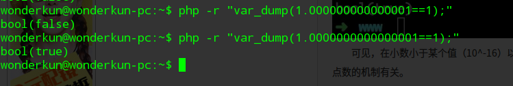

##考察php的变量特点和变量类型 

*******************************

要想拿到falg  需要满足下面这些条件  

>.is_numeric($number)

>.$number=intval(number)

>.intval($number)=intval(strrev($number))!=0  

>. 不是回文数 

第三个条件和第四个条件冲突啦!

######一.  利用intval()的限制绕过 
    最大的值取决于操作系统。 32 位系统最大带符号的 integer 范围是 -2147483648 到 2147483647。
    举例，在这样的系统上， intval('1000000000000') 会返回 2147483647。64 位系统上，最大带符号的 integer 值是 9223372036854775807。
    从上面我们可以知道，intval函数还依赖操作系统，很明显测试的环境系统是64位，所以应该选：9223372036854775807。
    但有个问题，它的回文数明显小于64位系统的限制，所以我们想到前面加个0；
    最终payload: ?number=09223372036854775807

######二 .  利用浮点数精度绕过

可见，在小数小于某个值（10^-16）以后，再比较的时候就分不清大小了，这与php内部储存浮点数的机制有关。

 所以，我们在执行这个if语句的时候if ($req["number"] != intval($req["number"]))，会先将右值转换成整数，
 再与左值比较。而左值是一个浮点数（1.000000000000001），所以右值又会被隐式地强制转换成浮点数1.0
 因为我前面说的特性，1.0其实也不是精准的1.0，所以php在比较的时候是不能精准比较浮点数的，所以它会『忽略』比10的-16次方更小的部分，然后就会认为左值和右值相等。
 
 利用这个特性 : 构造 number=1000000000000000.00000000000000010，即可绕过第一个if语句，并且拿到flag。 

###### 三.  利用函数特性绕过,获取第二个flag  
     
     查看 is_numeric 的源代码 :
     while(*str=' '||*str='\t'||*str='\n'||*str='\r'||*str='\v'||*str="\f" ){
         str++;
         length--;
     }
     可以看到,is_numeric()跳过了所有的空白字符, 所以 is_numeric("\r\n1.2") 会返回true
     同理 intval(" \r\n \t 12")，也会正常返回12

     但是，题目获取$req['number']的时候明明使用trim过滤了空白字符的呀？
     来看一下trim的源码 
     有这么一句  php_charmask((unsigned char *) "\n\r\t\v\0",6,mask TSRMLS_CC);

     发现少了 \f, 所以引入 %0c 在数字之前,就可以绕过 is_numeric()函数的判断 

     所以构造palyload:number=%0c676 就可以拿到第二个flag  

------------------------------------------------------------------

practice.php 解答  

number=%00%0c121

  

    

