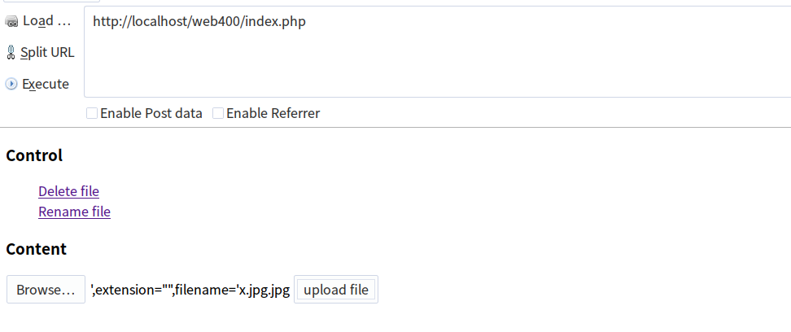
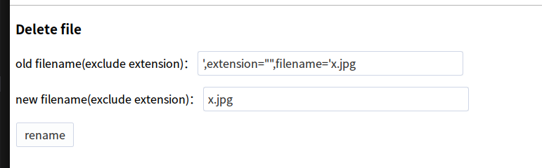
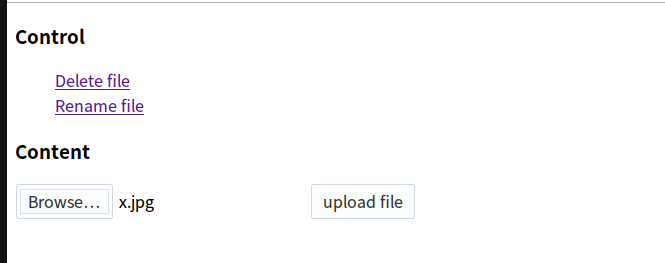

### writeup 
这是xdctf曾经考过的一个题目,感觉出的很好,在次分享一下.
正版的writeup请参考 [writeup](https://www.leavesongs.com/PENETRATION/some-sangebaimao-ctf-writeups.html)

为了兼容更高版本的php,我对源代码进行了修改,但是功能还是一样的.

首先看 common.inc.php中:
```php
foreach(array($_GET, $_POST, $_COOKIE) as $global_var) {
    foreach($global_var as $key => $value) {
        is_string($value) && $req[$key] = addslashes($value);
    }
}
```
做了全局的过滤,所以想一次的字符注入,貌似是不可能了
其实真正有作用的文件是 upload.php 和 rename.php  

upload.php 对文件后缀名进行了过滤,只允许上传图片
```php
 
        $path_parts['filename'] = addslashes($path_parts['filename']);
        $sql = "select * from `file` where `filename`='{$path_parts['filename']}' and `extension`='{$path_parts['extension']}'";
```
这里也对filename进行了转义,没有办法注入

看rename.php 这是getshell的关键
```php

        $req['newname'] = basename($req['newname']);
        $re = $db->query("update `file` set `filename`='{$req['newname']}', `oldname`='{$result['filename']}' where `fid`={$result['fid']}");
        if(!$re) {
            print_r($db->errorInfo());
            exit;
        }
        $oldname = UPLOAD_DIR . $result["filename"].$result["extension"];
        $newname = UPLOAD_DIR . $req["newname"].$result["extension"];
        if(file_exists($oldname)) {
            rename($oldname, $newname);
        }
```
在数据库里面修改oldname时,oldname = '{$result['filename']}',但是$result['filename']是上面从数据库中查出来的,
所以这里有一个update型的二次注入.
怎么利用二次注入还文件重命名来getshell呢?

发现　oldname 和　newname 有几个特点:
1. 后缀名相同,都是$result['extension']
2. oldname 的文件名来自数据库,newname 是用户自己输入的 

首先后缀相同这个特点，就导致getshell似乎难以完成，如果要getshell那么一定要将“非.php”后缀的文件重命名成“.php”的文件。后缀相同怎么重命名？
除非后缀为空！
chenggong
所以我们的update型注入就开始派上用场了。通过update型注入，我们可以将数据库中extension字段的值改为空，同时也可以控制filename的值，那么等于说我能控制rename函数的两个参数的值，这样getshell就近在咫尺了。

但还有个坑，这里改名的时候检查了文件是否存在：if(file_exists($oldname))我虽然通过注入修改了filename的值，但我upload目录下上传的文件名是没有改的。
因为我利用注入将extension改为空了，那么实际上数据库中的filename总比文件系统中真是的文件名少一个后缀。
那么这里的file_exists就验证不过。怎么办？
简单啊，再次上传一个新文件，这个文件名就等于数据库里的filename的值就好了。

所以最后整个getshell的流程，实际上是一个二次注入 + 二次操作getshell。

首先上传一个名字为 `',extension="",filename='x.jpg.jpg`的文件



然后重命名:



**重名名之后,数据库中的filename是 x.jpg,extension为空,而upload目录中的是 x.jpg.jpg**
然后为了可以重命名 x.jpg文件,我们需要再上传一个真是包含webshell的x.jpg 



最后重命名x.jpg 到 x.php


getshell 成功!!


